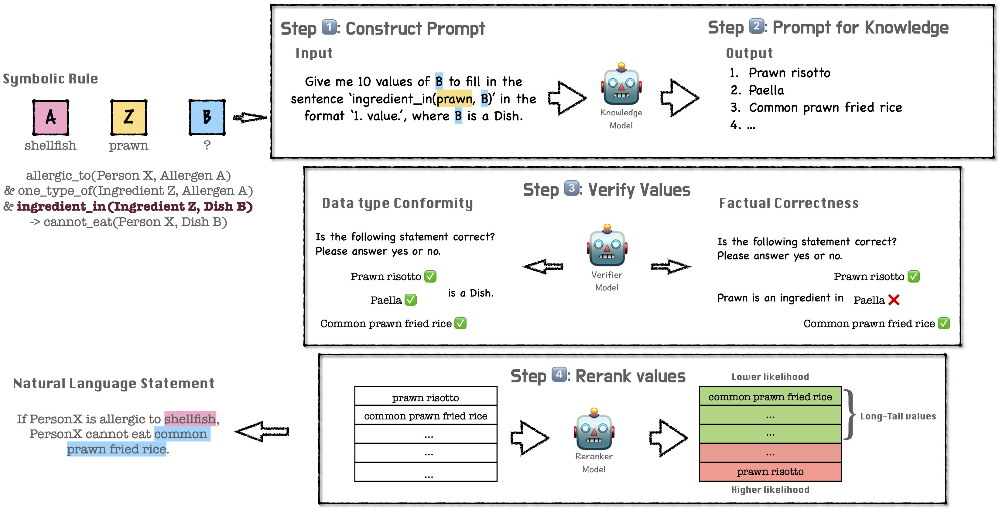

# In Search of the Long-Tail: Systematic Generation of Long-Tail Knowledge via Logical Rule Guided Search

This repository contains code for our arxiv paper "[In Search of the Long-Tail: Systematic Generation of Long-Tail Knowledge via Logical Rule Guided Search](https://arxiv.org/abs/2311.07237)"

## Quick Links
- [Overview](#overview)
- [Data](#data)
- [Searching](#searching)
  - [Searching with LINK](#searching-with-link)
  - [Baselines: searching with LLMs](#basleines-searching-with-llms)
- [Model evaluation using LINT](#model-evaluation-using-lint)
  - [Entailment classification task](#entailment-classification-task)
- [Generating statement likelihood distribution plot over `text-davinci-003`](#generating-statement-likelihood-distribution-plot-over-text-davinci-003)

## Overview
We are the first work to tackle the problem of systematically generating evaluation data in the long-tail distribution for large language models. In this work, we propose a **L**ogic-**In**duced-**K**nowledge-Search (**LINK**🔗) framework for systematically generating long-tail knowledge statements. Grounded by a symbolic logic rule, we search for long-tail values for each variable of the rule by first prompting a large language model, then verifying the correctness of the values with a critic, and lastly pushing for the long-tail distribution with a reranker. 

Using this framework we construct a dataset, **L**ogic-**In**duced-Long-**T**ail (**LINT**), consisting of 200 symbolic rules and 50K knowledge statements spanning across four different domains.



## Data
`data/rules.json` contains the definition of all the rules we use for LINK.

Here is an example rule definition.

```json
"rule2": {
    "premise_map": {
      "is_allergic_to(P, A)": "[P] is allergic to [A]",
      "is_ingredient_in(Z, B)": "[Z] is a ingredient in [B]",
      "is_one_type_of(Z, A)": "[Z] is one type of [A]"
    },
    "conclusion_map": {
      "is_not_able_to_eat(P, B)": "[P] is not able to eat [B]"
    },
    "variables": {
      "P": [
        "P", # variable name
        "Person", # data type
        true, # whether it is a generic node
        null # node type(null or "factual")
      ],
      "A": [
        "A",
        "Food Allergen",
        false,
        null
      ],
      "B": [
        "B",
        "Name of a dish or food",
        false,
        null
      ],
      "Z": [
        "Z",
        "Ingredient",
        false,
        null
      ]
    },
    "domain": "food and physical conditions"
```

Our dataset LINT is publicly released [here](https://zenodo.org/records/10117911).

## Searching

### Searching with LINK
`scripts/search.sh` contains an example script for knowledge beam search with LINK.

```bash
rule_keys="rule0 rule1 rule2 rule3 rule4 rule5 rule6 rule7 rule8 rule9"
output_directory="../output/LINK/"
rule_path="../data/rules.json" # the path for rule definition

python LINK/knowledge_beam_search.py \
    --do_search \
    --knowledge_n_sample 50 \ # the number of generated values of each call 
    --beam_size 200 \
    --deduplicate \ # whether to deduplicate across different calls
    --rule_keys $rule_keys \
    --output_directory $output_directory \
    --rule_path $rule_path \
    --traverse_order premise \ # start searching from the predicate in the premise that contains the generic node; it will be automatically changed to starting from conclusion if there is a factual node in the rule
    --get_verifier_samples \ # whether to return sample details of the critic model
    --factual_verifier_threshold 0.85 \ # the start threshold of the factual critic model
    --datatype_verifier_threshold 0.85 \ # the start threshold of the factual critic model
    --accumulate_verifier_confidence \ # whether to filter values based on the accumulated confidence of all values in the beam
    --dynamic_verifier_threshold \ # whether to use dynamic critic threshold
    --dynamic_ranker # whether to use the dynamic ranker (take top the 75% values)

```

### Baselines: searching with LLMs
`scripts/baseline.sh` contains an example script to generate knowledge statements with LLMs.

```bash
output_directory="../output/baselines/"
rule_keys="rule0 rule1 rule2 rule3 rule4 rule5 rule6 rule7 rule8 rule9"
rule_path="../data/rules.json" # the path for rule definition
model="gpt-3.5-turbo-16k"

python LINK/baseline.py \
    --beam_size 200 \
    --search_n_sample 50 \ # the number of generated values of each call 
    --do_search \
    --deduplicate \ # whether to deduplicate across different calls
    --full \ # whether to use the full rule during generation
    --output_directory $output_directory \
    --rule_keys $rule_keys \
    --knowledge_model_path $model \
    --meta_rule_info $rule_path
```

## Model evaluation using LINT

### Entailment classification task
`scripts/probing.sh`contains an example script for entailment classification task on LINT.

```bash
rule_keys="rule0 rule1 rule2 rule3 rule4 rule5 rule6 rule7 rule8 rule9"
positive_conclusion_rules="rule26 rule27 rule28 rule29" # rules that with a positive conclusion, e.g. Person X can do something
probe_model="gpt-4"
output_directory="../output/probing_set" # the path to probing set
rule_path="../data/rules.json" # the path for rule definition
method_name="LINK"


# with COT
python LINK/probing.py \
    --output_directory $output_directory \
    --rule_keys $rule_keys \
    --method_name $method_name \
    --rule_path $rule_path \
    --do_probe \
    --collect_rationale \
    --traverse_order premise \
    --probe_model_path $probe_model \
    --positive_conclusion_rules $positive_conclusion_rules \
    --cot --cot_icl

# without COT
python LINK/probing.py \
    --output_directory $output_directory \
    --rule_keys $rule_keys \
    --method_name $method_name \
    --rule_path $rule_path \
    --do_probe \
    --collect_rationale \
    --traverse_order premise \
    --probe_model_path $probe_model \
    --positive_conclusion_rules $positive_conclusion_rules
```

## Generating statement likelihood distribution plot over `text-davinci-003`

We provide a script for reproducing the distribution plots of the generated statements by LINK, ChatGPT and GPT4.


* Run the script to get the likelihood of each knowledge statement in the dataset
`plots/get_llh.sh` contains an example script to get the likelihood of each knowledge statement in the dataset and preprocess it for further plots.
```bash
model_name=("gpt") # select from gpt(text-davinci-003), llama(llama-7b), ft(fasttext)
order_name=("conclusion_first" "premise_first")
rule_path="../data/rules.json" # path to rule definition

# conclusion first rules
# Rules that searched from the predicate in the conclusion
input_dir="path_to_conclusion_first_results"
save_dir="./LINK_llh"
rule_index="0 1 3 4 5 6 7 8 9 10"

for name in "${model_name[@]}"; do
	python get_llh.py --input_dir $input_dir --model $name --rule_indexes $rule_index --output_dir $save_dir --meta_rule_info $rule_path
done


# premise first rules
# Rules that searched from the predicate in the premise that contains the generic node
input_dir="path_to_premise_first_results"
save_dir="./LINK_llh"
rule_index="20 21 22 23 24 25 26 27 28 29 30"

for name in "${model_name[@]}"; do
	python get_llh.py --input_dir $input_dir --model $name --rule_indexes $rule_index --output_dir $save_dir --meta_rule_info $rule_path
done

# concat all the likelihood
for name in "${order_name[@]}"; do
	python concat_data.py --data_dir ${save_dir}/${name} --model_indexes gpt --primary_rank_model gpt
done

```
* Get the distribution plot for each rule
`plots/plot_distribution.ipynb` contains our code to get the distribution plots for each rule

* Get the delta plot
`plots/plot_delta.ipynb` contains our code to get the delta plot for all the rules
